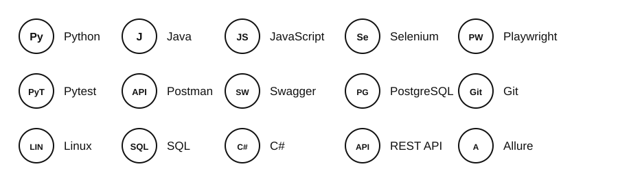

 

### QA Engineer

`Python` · `Java` · `Playwright` · `Selenium` · `Pytest` · `Allure`

<td width="35%" align="center">

<h2>About Me</h2>

QA Engineer with practical experience in web and mobile application testing.
Currently developing in test automation with Python, Playwright and Pytest.

Currently focused on building reliable UI and API automated tests
and improving my skills in test automation.

<h3>Tech Stack</h3>

 

 
 
`Smoke Testing` · `Functional Testing` · `Regression Testing` · `UI/API Testing` 
 

